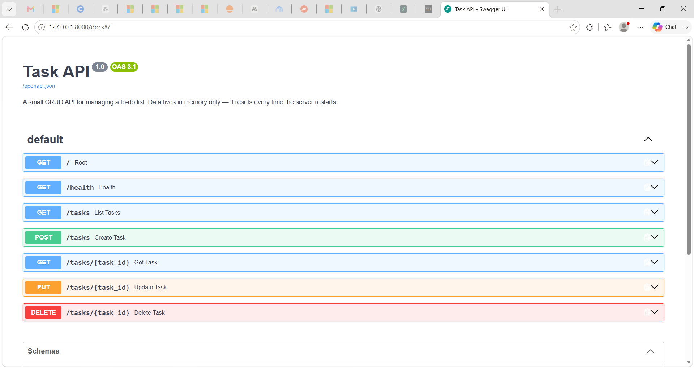

# first-api — A Task CRUD API Built from First Principles

A small, deliberately minimal FastAPI service that proves the fundamentals of backend development: the request → response cycle, CRUD operations, HTTP status codes, and input validation — before any framework magic or database complexity gets added on top.


---

## Overview

Most backend tutorials introduce a framework's opinions before the fundamentals stick. This project strips that away: a Task API with the four CRUD operations mapped directly onto HTTP methods — `POST` creates, `GET` reads, `PUT` updates, `DELETE` removes — backed by nothing more than a Python list in memory. There's no database, no auth, no ORM to obscure what's actually happening when a client sends a request and a server sends back JSON.

That constraint is the point. Every status code (`200`, `201`, `204`, `400`, `404`) is chosen deliberately and tested by hand, every validation rule exists because the server explicitly checks for it, and the whole thing runs in under 150 lines. It's the first rung of a backend track, and the README says so on purpose rather than dressing it up as more than it is.

## Features

- **Full CRUD** on a task resource — create, list, retrieve, update, delete
- **Correct HTTP semantics** — `POST` → `201`, successful `DELETE` → `204`, unknown id → `404`, invalid input → `400`
- **Input validation** — a missing or empty `title` is rejected before it ever reaches storage
- **Consistent error shape** — every error response is `{"error": "..."}`, including cases FastAPI would otherwise default to a different format (`422` on a malformed body is normalized to `400`)
- **Self-documenting** — a `GET /` endpoint describes the API's name, version, and available routes; `GET /health` gives a standard liveness check
- **Zero-setup interactive docs** — Swagger UI at `/docs`, generated automatically from the code, no separate spec file to maintain
- **Zero external dependencies** beyond the web framework and server — nothing to obscure the core request/response mechanics

## Tech Stack

| Layer | Choice |
|---|---|
| Language | Python 3.10+ |
| Framework | FastAPI |
| Server | Uvicorn (ASGI) |
| Data validation | Pydantic |
| Storage | In-memory Python list *(by design — no database yet)* |
| Testing | curl, FastAPI's Swagger UI |

## Screenshots / Demo


*FastAPI's auto-generated `/docs` page — every endpoint listed, with a working "Try it out" for the full CRUD cycle.*

## Installation

```bash
# 1. Clone the repo
git clone https://github.com/fsafva13-coder/first-api.git
cd first-api

# 2. Install dependencies
pip install -r requirements.txt

# 3. Run the server
uvicorn main:app --reload
```

The API is now live at `http://127.0.0.1:8000`.

## Usage

Every endpoint can be exercised two ways: `curl` from the terminal, or Swagger UI in the browser.

**Via curl:**

```bash
# API info
curl -i http://127.0.0.1:8000/

# Health check
curl -i http://127.0.0.1:8000/health

# List all tasks
curl -i http://127.0.0.1:8000/tasks

# Get one task
curl -i http://127.0.0.1:8000/tasks/1

# Create a task
curl -i -X POST http://127.0.0.1:8000/tasks \
  -H "Content-Type: application/json" \
  -d '{"title":"Buy milk"}'

# Update a task
curl -i -X PUT http://127.0.0.1:8000/tasks/1 \
  -H "Content-Type: application/json" \
  -d '{"done":true}'

# Delete a task
curl -i -X DELETE http://127.0.0.1:8000/tasks/1
```

**Via Swagger UI:** open `http://127.0.0.1:8000/docs`, expand any endpoint, click "Try it out," and send real requests from the browser — no terminal required.

**Real output, from an actual run:**

```
$ curl -i http://127.0.0.1:8000/tasks/1
HTTP/1.1 200 OK
content-type: application/json

{"id":1,"title":"Buy groceries","done":false}

$ curl -i -X POST http://127.0.0.1:8000/tasks -H "Content-Type: application/json" -d '{"title":"Buy milk"}'
HTTP/1.1 201 Created
content-type: application/json

{"id":4,"title":"Buy milk","done":false}
```

## Project Structure

```
first-api/
├── main.py             # App definition — all five task endpoints, in-memory store, error handling
├── requirements.txt    # fastapi, uvicorn
├── .gitignore
└── README.md
```

## Results / Behavior

This project doesn't produce metrics in the traditional sense — its "result" is correct, predictable API behavior, verified endpoint by endpoint:

| Endpoint | Verified behavior |
|---|---|
| `GET /` | Returns API metadata (`200`) |
| `GET /health` | Returns liveness status (`200`) |
| `GET /tasks/{id}` | Returns the task (`200`) or a named 404 (`Task 99 not found`) |
| `POST /tasks` | Creates and returns the task (`201`), or rejects a missing/empty title (`400`) |
| `PUT /tasks/{id}` | Updates title and/or done status (`200`), rejects an empty body (`400`), 404 on unknown id |
| `DELETE /tasks/{id}` | Removes the task (`204`), 404 on unknown id |

One deliberate, observed limitation: data lives only in the server's memory. Restarting the process resets the task list back to its three seeded examples — this is the exact gap the next stage of this project (moving storage to SQLite) closes.

## Challenges & Learnings

The hardest part wasn't the routing — it was resisting the urge to add scope before the fundamentals were solid. Getting the error *shape* right, specifically, took more thought than the happy path: FastAPI's default validation error returns `422` with a `{"detail": ...}` body, but this project's spec calls for `400` with `{"error": ...}` everywhere, including a missing-title `POST` and an empty `PUT` body. Rather than hand-checking every route individually, a single global exception handler on `RequestValidationError` normalizes any malformed request into the required shape in one place — a small example of the difference between code that happens to work and code built to a spec.

## Future Improvements

- Move storage from an in-memory list to **SQLite**, so data survives a restart
- Add filtering (`?done=true`) and search (`?search=`) query parameters
- Add a `/stats` endpoint that computes totals server-side
- Add automated tests with `pytest` instead of manual curl verification
- Deploy to a public URL (Render/Railway) once persistence is in place

## Demo / Live Link

*Not deployed yet* — this project currently runs locally only (`http://127.0.0.1:8000`). A live deployment is planned once the SQLite persistence layer is in place, so the demo has real state worth showing off.

## License

MIT